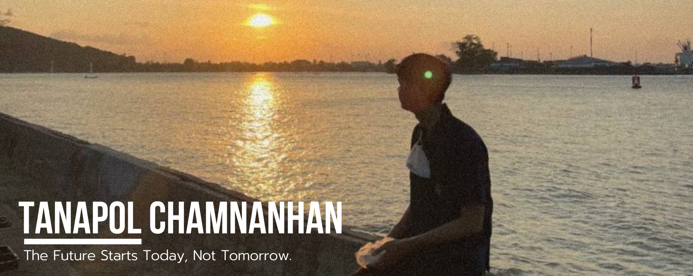

# Hi I'm Tanapol Chamnanhan 👋
## Welcome to my Github Profile ✨

💕 Hello everyone.  My name is Tanapol Chamnanhan. I am a student of computer engineering and I am a student of information Technology. I liked to code, create website and create innovation.

## Personal Information
- Mr.Tanapol Chamnanhan
- Mobile : +66 96-243-7210
- Email : tanapol.ch@rmutsvmail.com
- Nationality : Thai

## Education
#### ⚡ I'm graduated Vacational Certificate at Songkhla Technical Collage Major in Information Techonology , Songkhla , Thailand May 2017 - March 2019 
#### ⚡ I’m currently studying for a Bachelor's degree in Computer Engineering at Rajamangala University of Technology Srivijaya

## Honors
- Joined in the line-following robot competition at Rajamangala University of Technology Srivijaya
- Accredited professional qualifications Digital Industry Profession Software and Applications system tester level 4 
- Joined StartUp Thailand Leage Coaching 2021
- Joined StartUp Thailand Leage 2022
- Joined academic competition in The ASEAN Undergraduate Conference In Computing 2023 (AUC2)

## Work Experience
- Technical Apprentice at Advice Songkhla 14 October 2019 - 15 December 2019

#### 😄Quotes
>"อย่าอ้อนขอ จงไขว่คว้ามา ไม่งั้นก็ไม่มีทางจะสำเร็จ こうきょうしへんエウレカセブン
>
> ~ ฮอลแลนด์ โนวัก(~ ホランド・ノヴァク ~ Holland Novac)
<!--
**TawittyTC/TawittyTC** is a ✨ _special_ ✨ repository because its `README.md` (this file) appears on your GitHub profile.

Here are some ideas to get you started:

- 🔭 I’m currently working on ...
- 🌱 I’m currently learning ...
- 👯 I’m looking to collaborate on ...
- 🤔 I’m looking for help with ...
- 💬 Ask me about ...
- 📫 How to reach me: ...
- 😄 Pronouns: ...
- ⚡ Fun fact: ...
-->
